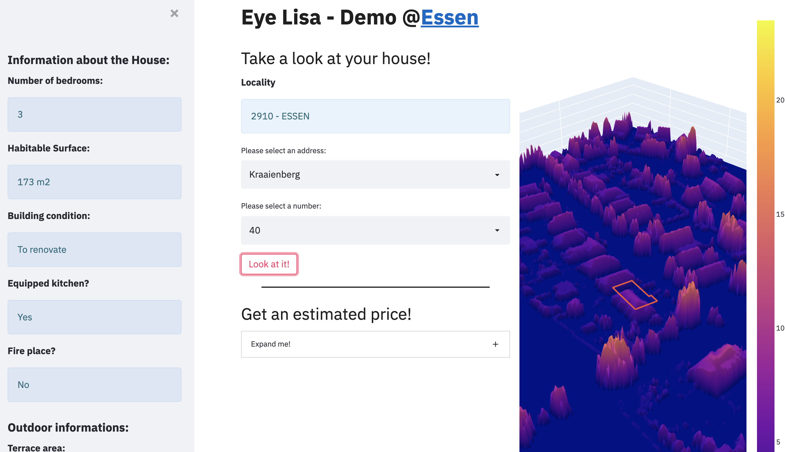
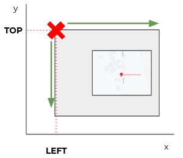
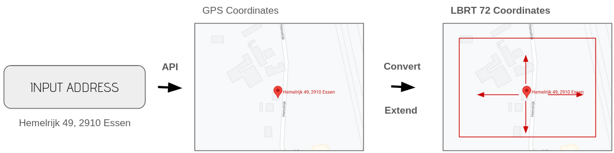
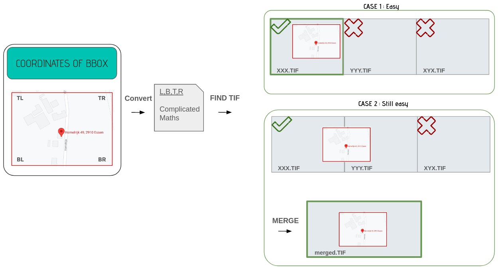

# Eye-Lisa - house visualisation and price estimation app

Eye-Lisa is an app allowing to visualise any property in its environment. Furthermore, it offers to possibility to estimate the price of it:
- If we have it in our dataset it will automatically give an estimated price
- If we don't, you still have the possibility to give the informations about it and receive an estimated price.

#### This application is a response to a challenge given by [Becode](https://becode.org/):
- Given [LIDAR data](https://www.geopunt.be/catalogus/datasetfolder/4a23f2e7-aadd-4321-82d9-50fcd35fa856), deploy an application where the user type an address and see the location in 3D. 

It was solved in 2 weeks.

> Disclaimer: The current app only works for Essen in Flanders due to lack of space. 

### __Sneak Peek__

# Process:
## Preprocessing the GEOTifs:
First, we had to reduce the size of the geotif (+-1GB) to be able to use it without loss of performances. In order to do so, we divided all the tif in smaller tif of a size of 100 hectares (+-4MB).
To recover the right tif, we named them by their coordinates; that is, the Top coordinate (greatest y) et the left coordinate (smallest x).

Then for a specific address, we have Lambert72 coordinates and we do a euclidian division to get the root of the top and the left coordinates. We'll talk about it later.

## Fetching the address:
 

## Fetching the tif:
 

## Masking the tif:
We take the tiff crop it to have the size of the desired span (150 meters from the center to the four coodinates)

 ## Plotting it:
Use of Plotly and add the trace of the building.

## Future improvements

- **Modelising in 3D the house and put it in its environment**: Currently, it only offers a visualisation based on plot (Plotly). In the long term, it would be interesting to modelise it via ThreeJS and and add it to it environment.

- **Compressing the GEOTif's**: One of the big issue in this project is space. To plot every places in Belgium, we should have the [DTM](https://www.neonscience.org/resources/learning-hub/tutorials/chm-dsm-dtm-gridded-lidar-data) and the [DSM](https://www.neonscience.org/resources/learning-hub/tutorials/chm-dsm-dtm-gridded-lidar-data) for Flanders, Wallonia and Brussels and store it. One way, to reduce the space would be to compress the GEOTif's.

# 3D House Project

- Repository: `3D_houses`
- Type of Challenge: `Learning & Consolidation`
- Duration: `2 weeks`
- Deadline: `02/07/21 17:00 AM`
- Deployment strategy :
  - GitHub page
  - PowerPoint
  - Jupyter Notebook
  - Webpage
  - App
- Team challenge : `Team`

## Mission objectives

Consolidate the knowledge in Python, specifically in :

- NumPy
- Pandas
- Matplotlib

## Learning Objectives

- to be able to search and implement new libraries
- to be able to read and use the [shapefile](https://en.wikipedia.org/wiki/Shapefile) format
- to be able to read and use geoTIFFs
- to be able to render a 3D plot
- to be able to present a final product

## The Mission

> We are _LIDAR PLANES_, active in the Geospatial industry. We would like to use our data to launch a new branch in the insurance business. So, we need you to build a solution with our data to model a house in 3D with only a home address.

### Must-have features

- 3D lookup of houses.

### Nice-to-have features

- Optimize your solution to have the result as fast as possible.
- Features like the living area of the house in m², how many floors, if there is a pool, the vegetation in the neighborhood, etc...
- Better visualization.

### Miscellaneous information

#### What is LIDAR ?

LIDAR is a method to measure distance using light. The device will illuminate a target with a laser light and a sensor will measure the reflection. Differences in wavelength and return times will be used to get 3D representations of an area.

Here is a LIDAR segmentation :

With those points clouds we can easily identify houses, vegetation, roads, etc...

The results we're interested in are DSM (Digital Surface Map) and DTM (Digital Terrain Map).

Which are already computed and available here :

- [DSM](http://www.geopunt.be/download?container=dhm-vlaanderen-ii-dsm-raster-1m&title=Digitaal%20Hoogtemodel%20Vlaanderen%20II,%20DSM,%20raster,%201m)
- [DTM](http://www.geopunt.be/download?container=dhm-vlaanderen-ii-dtm-raster-1m&title=Digitaal%20Hoogtemodel%20Vlaanderen%20II,%20DTM,%20raster,%201m)

## Deliverables

1. Publish your source code on the GitHub repository.
2. Pimp up the README file:
   - Description
   - Installation
   - Usage
   - (Visuals)
   - (Contributors)
   - (Timeline)
   - (Personal situation)
3. Show us your results in a nice presentation.
4. Show us a live demo.

### Steps

1. Create the repository
2. Study the request (What & Why ?)
3. Download the maps
4. Identify technical challenges (How ?)

## Evaluation criteria

| Criteria       | Indicator                                                                   | Yes/No |
| -------------- | --------------------------------------------------------------------------- | ------ |
| 1. Is complete | There are no warnings/errors in the console.                                |        |
|                | You push your changes to GitHub at least once a day.                        |        |
|                | There is a visualization available for one house.                           |        |
| 2. Is great    | One can select an address and have the building at that address visualized. |        |

## A final note of encouragement

