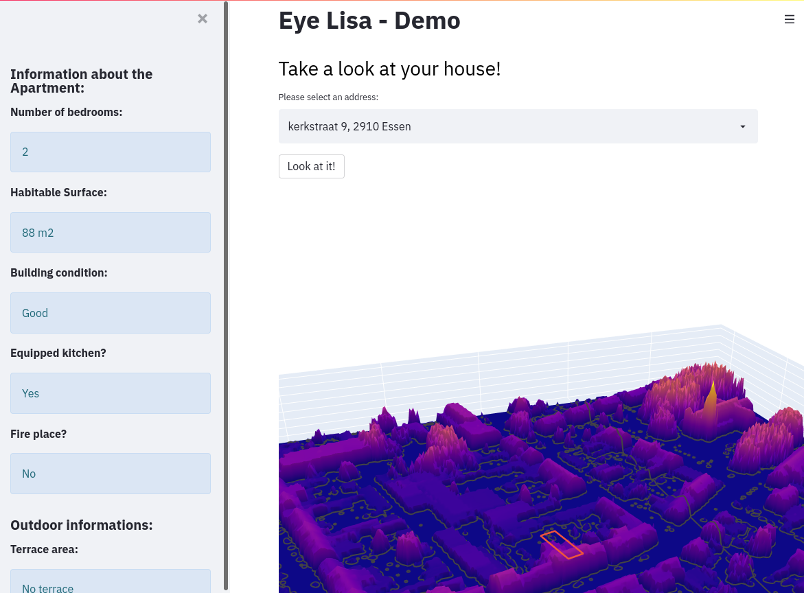

# Eye-Lisa - house visualisation and price estimation app

Eye-Lisa is an app allowing to visualise any property in its environment. Furthermore, it offers to possibility to estimate the price of it:
- If we have it in our dataset it will automatically give an estimated price
- If we don't, you still have the possibility to give the informations about it and receive an estimated price.

#### This application is a response to a challenge given by [Becode](https://becode.org/):
- Given [LIDAR data](https://www.geopunt.be/catalogus/datasetfolder/4a23f2e7-aadd-4321-82d9-50fcd35fa856), deploy an application where the user type an address and see the location in 3D. 

It was solved in 2 weeks.

> Disclaimer: The current app only works for Essen in Flanders due to lack of space. 

### Sneak Peek

## Process:

## Future improvements

- **Modelising in 3D the house and put it in its environment**: Currently, it only offers a visualisation based on plot (Plotly). In the long term, it would be interesting to modelise it via ThreeJS and and add it to it environment.

- **Compressing the GEOTif's**: One of the big issue in this project is space. To plot every places in Belgium, we should have the [DTM](https://www.neonscience.org/resources/learning-hub/tutorials/chm-dsm-dtm-gridded-lidar-data) and the [DSM](https://www.neonscience.org/resources/learning-hub/tutorials/chm-dsm-dtm-gridded-lidar-data) for Flanders, Wallonia and Brussels and store it. One way, to reduce the space would be to compress the GEOTif's.
